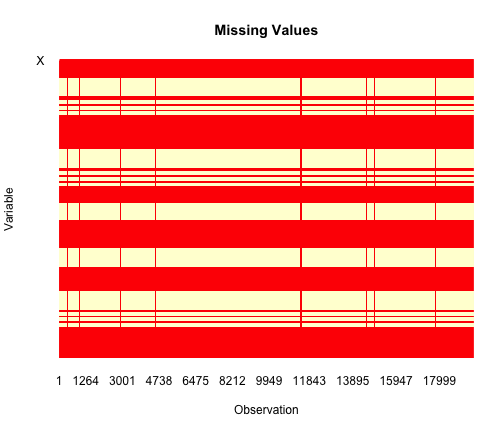
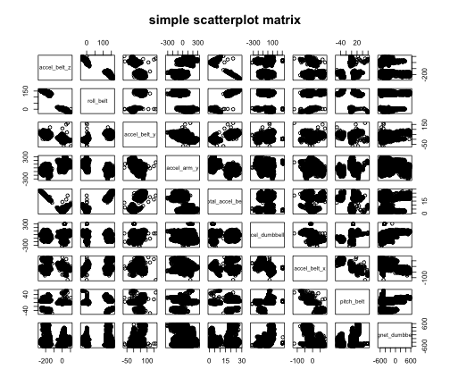
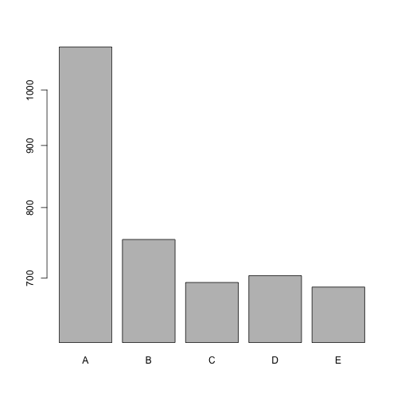

Practical Machine Learning Project - Measure The Quality Of Tracked Activities
================================================================================

# Executive Summary
The objective of this project is to measure the quality of performing a set of activities done by a group of people. In order to do so, we need to build a predictive model that allow us to predict the class of performance based on a set of indicators/predictors. This report will take us through all the steps we have followed to get a very accurate model that scores 100% accuracy when it has been applied on test data (20 cases). More specifically, for each observation, we need to predict if it is (Class A -exactly according to the specification-, Class B -throwing the elbows to the front-, Class C -lifting the dumbbell only halfway-, Class D -lowering the dumbbell only halfway-, Class E -throwing the hips to the front-)
We use caret, randomForest and ggplot2 packages in order to build a proper predictive model.

# Data Splitting
In this project, we have the training and testing datasets provided. where training dataset cotains 19622 observations (ratio 0.9989818 of the overall datset) and testing set has 20 cases only (ration 0.001018226).  However, for good prediction and better testing dataset ratio, we apply data partitioning with 80% for training data and 20% for testing data on the original training data we have. 


# Pre-processing

## 1- Exploratory Data Analysis:
As a first step of pre-processing, we do some exploratory data analysis to understand the data we have. We apply different functions such as dim, names, str, summary..etc

```r
str(ds_train)
dim(ds_train)
summary(ds_train)
head(ds_train,1)
dim(ds_test)
names(ds_train)
```
The data summery shows a number of columns where there is a big number of NA's and others with a big number of empty values. so we dig more as Figure 1 below shows the distrubution of NA's values per columns. We notice a very high number of NA's for some columns and we see a clear pattern of NA's values per rows. It is equal (either NA's or empty values) to 15386 from 15699 in trainig dataset portion (after pliting) and 19216/19622 in the original training dataset (before spliting). 
 
## 2- Elimnate Zero- and Near Zero-Variance Predictors
Based on previous analysis, we decide to elimnate Zero- and Near Zero-Variance Predictors and sparse variables using a threshold equal to 15000. (NA's total number of columns = 67) and (empty values totlal number of columns = 33). This lead us to a new dataset where dimensions are (15699, 60)

```r
sum(is.na(actTrain$max_roll_belt))
ds_trainNonNa<- actTrain[, colSums(is.na(actTrain))<15000]
ds_train_clean<- ds_trainNonNa[, colSums(ds_trainNonNa=="")<15000]
```
## 3- Create Dummy Variables:
In this step, we create dummy variables for factor predictors using dummyVars function from caret 

```r
ds_train_clean<- ds_train_clean[, -c(1, 2, 3, 4, 5)]
dummies <- dummyVars("classe ~ .", data = ds_train_clean)
ds_train_dumm<- data.frame(predict(dummies, newdata = ds_train_clean))
ds_train_dumm$classe<- ds_train_clean[,55]
```
## 4- Identify Correlated Predictors:
We define a threshold for calculating correlations (0.57) betweeen predictors. Here is a list of predictors names which are coorelated:

```r
descrCor <-  cor(ds_train_dumm[, -56])
highlyCorDescr <- findCorrelation(descrCor, cutoff = .75)
ds_train_noCor <- ds_train_dumm[,-highlyCorDescr]
names(ds_train_dumm[,highlyCorDescr])
```

```
##  [1] "accel_belt_z"      "roll_belt"         "accel_belt_y"     
##  [4] "total_accel_belt"  "accel_dumbbell_z"  "accel_belt_x"     
##  [7] "pitch_belt"        "magnet_dumbbell_x" "accel_dumbbell_y" 
## [10] "magnet_dumbbell_y" "accel_dumbbell_x"  "accel_arm_x"      
## [13] "accel_arm_z"       "magnet_arm_y"      "magnet_belt_z"    
## [16] "accel_forearm_y"   "gyros_forearm_y"   "gyros_dumbbell_x" 
## [19] "gyros_dumbbell_z"  "gyros_arm_x"       "new_window.yes"
```
Figure2 below shows examples of correlated variables.
 

## 5- Calculate Linear Dependencies:
We use findLinearCombos function from caret package for linear dependencies uses the QR decomposition of a matrix to enumerate sets of linear combinations. In our dataset, no linear dependeincies exist as results show below.


## 6- Apply Centering and Scaling:
We use preProcess class for centering and scaling predictors. predict function applies centring anf scaling over or datset predictos. 
results below shows the mins values of predictors before and after centering and scaling: 

```
## Warning in sweep(newdata, 2, object$mean, "-"): STATS does not recycle
## exactly across MARGIN
```

```
## Warning in sweep(newdata, 2, object$std, "/"): STATS does not recycle
## exactly across MARGIN
```

```
##  new_window.no        num_window         yaw_belt        
##  "Min.   :0.0000  " "Min.   :  1.0  " "Min.   :-179.00  "
##   gyros_belt_x          gyros_belt_y         gyros_belt_z      
##  "Min.   :-1.000000  " "Min.   :-0.64000  " "Min.   :-1.4600  "
##  magnet_belt_x      magnet_belt_y        roll_arm       
##  "Min.   :-52.00  " "Min.   :354.0  " "Min.   :-180.0  "
##    pitch_arm            yaw_arm            total_accel_arm  
##  "Min.   :-88.800  " "Min.   :-180.0000  " "Min.   : 1.00  "
##   gyros_arm_y         gyros_arm_z         accel_arm_y       
##  "Min.   :-3.4400  " "Min.   :-2.1700  " "Min.   :-318.00  "
##   magnet_arm_x       magnet_arm_z      roll_dumbbell      
##  "Min.   :-584.0  " "Min.   :-597.0  " "Min.   :-153.71  "
##  pitch_dumbbell       yaw_dumbbell        total_accel_dumbbell
##  "Min.   :-149.59  " "Min.   :-150.871  " "Min.   : 0.0  "    
##  gyros_dumbbell_y     magnet_dumbbell_z    roll_forearm       
##  "Min.   :-2.10000  " "Min.   :-262.00  " "Min.   :-180.000  "
##  pitch_forearm       yaw_forearm        total_accel_forearm
##  "Min.   :-72.50  " "Min.   :-180.00  " "Min.   :  0.00  " 
##  gyros_forearm_x      gyros_forearm_z      accel_forearm_x    
##  "Min.   :-22.0000  " "Min.   : -8.0900  " "Min.   :-498.00  "
##  accel_forearm_z     magnet_forearm_x    magnet_forearm_y  
##  "Min.   :-446.00  " "Min.   :-1280.0  " "Min.   :-896.0  "
##  magnet_forearm_z   classe    
##  "Min.   :-973.0  " "A:4464  "
```

```
##  new_window.no           num_window             yaw_belt           
##  "Min.   :-16.59615  " "Min.   :  -16.540  " "Min.   :-2227.8251  "
##   gyros_belt_x         gyros_belt_y         gyros_belt_z         
##  "Min.   :-16.6241  " "Min.   :-16.6048  " "Min.   :-16.626350  "
##  magnet_belt_x        magnet_belt_y           roll_arm           
##  "Min.   :-573.236  " "Min.   :  -6.110  " "Min.   :-2227.8251  "
##    pitch_arm               yaw_arm             total_accel_arm     
##  "Min.   :-1117.9780  " "Min.   :-2240.5527  " "Min.   :-16.5123  "
##   gyros_arm_y           gyros_arm_z          accel_arm_y         
##  "Min.   :-37.53160  " "Min.   :-22.3858  " "Min.   :-3551.496  "
##   magnet_arm_x          magnet_arm_z         roll_dumbbell         
##  "Min.   :-6809.763  " "Min.   :-7115.225  " "Min.   :-1878.8910  "
##  pitch_dumbbell          yaw_dumbbell          total_accel_dumbbell
##  "Min.   :-1126.1074  " "Min.   :-1740.9806  " "Min.   :-16.5682  "
##  gyros_dumbbell_y     magnet_dumbbell_z      roll_forearm         
##  "Min.   :-24.4222  " "Min.   :-2991.481  " "Min.   :-2291.4631  "
##  pitch_forearm          yaw_forearm           total_accel_forearm 
##  "Min.   :-885.0628  " "Min.   :-2291.4631  " "Min.   :-16.5682  "
##  gyros_forearm_x      gyros_forearm_z      accel_forearm_x      
##  "Min.   :-21.3675  " "Min.   :-33.3315  " "Min.   :-5969.741  "
##  accel_forearm_z       magnet_forearm_x      magnet_forearm_y      
##  "Min.   :-4976.988  " "Min.   :-16164.55  " "Min.   :-11200.786  "
##  magnet_forearm_z      
##  "Min.   :-12257.178  "
```

# Model Tuning
We apply random forest algorithm using randomForest package over three different versions of the pre-processed training dataset: 1) first on the dataset pre-processed using 1 -2 -3 explained steps previously, 2) second on the dataset pre-processed using 1 -2 -3 -4 steps and 3) third on the dataset pre-processed using 1 -2 - 3 - 4 - 5 - 6 steps. 
We also set a specific seed so we can rerun the experiment. we applied this over the training dataset no splitting (15699) plus the training dataset with splitting (80% from whole training datset).
We predict results using first model on the testing datset we did (20% of whole data), confusion matrix showed below with error rates object accuracy = 4/(1116+758+684+641+720) = 0.001. 
Over the 20 observations of tetsing data, accuracy measures show that first model performs on training datset no splitting with error rate = 0.14, training dataset with splitting 0.18%. and when we have applied it on the 20 cases of testing datatset, it returns 20/20 correct values (100% accuracy) traing data splitted and not splitted, both cases. The second and third models performs worse than first one with error rates 0.15% (no splitting) 0.22% (with splitting) and 0.16% (no splitting)  0.21% (with spliting), accuracy 20/20 and 15/20 consequently.

```r
set.seed(33833)
m1<- randomForest(classe ~ ., data=ds_train_dumm) 
m2<- randomForest(classe ~ ., data=ds_train_noCor)
trainTransformed$classe<- ds_train_clean[,55]
model<- randomForest(classe ~ ., data=trainTransformed) 
## predict values over testing dataset patition (20% of whole dataset)
actTest$new_window.no<- 0
actTest$new_window.yes<- 0
pred <- predict(m1,actTest)
table(observed = actTest[, 160], predicted = pred)
```

# Model Performance

## 1- Feature Selection and Cross Validation
Based on previous model tuning, we chose the first model for our predictions as it shows perfect accuracy, lowest error rate and excellent results. However, we decided to do more experement in order to refine this model and consider only important variables. The objectives of this section is to see if we can have high quality model with less variables and also detect and prevent  overfitting if exists as we believed the 20 testing observations might not be enough to reflect the real performace of our model. In order to do so, we have used Cross Validation over random forst, rfcv function.  We have chosed number of k folds first equal to 3 (to avoid waiting long time for getting results) and then k-fold = 10 based on Kohavi study of cross-validation and bootstrap for accuracy estimation and model selection. It shows how choosing high K values (as for leave-one-out) usually results in lower bias, higher variance estimators; using low K values results in higher bias, lower variance estimators. However, as Kohavi showed in the cited article, the number 10 seems to strike a good balance for many problems [1]. As results, both three and ten k folds return similar important variables and performance.

```r
#result3 <- rfcv(ds_train_dumm, ds_train_dumm$classe, cv.fold=3) 
#result10 <- rfcv(ds_train_dumm, ds_train_dumm$classe, cv.fold=10) commented because it takes long time to process
```

## 2- Variable Importance Estimation
applying random forst cross validation over our training datset shows that variable n.var shows the following variables as the most important once for creating our predictive model. which are: 1) var pitch arm, 2) avg roll belt, 3) kurtosis yaw belt, 4) num window, 5)     raw timestamp part 2 and 6) X with 0 errors. 
Based on that we run random forst function again on a subset of our training dataset with 6 predictors, only important variablesa ccording to cross validation random forest. As result, we got  error rate estimation equal to 23.52%. 5% increase than 56 predictors model. However, accuracy results = 16/20= 0.8 on 20 testing observations, this shifted us from 100% accuracy to 80%. Hence, our conclusion is to use variable importance and cross validation if you have a big number of predictors so this at least guarantee good performance and running model returns results in reasonable time. However, if you can run your model using all the predictors (for this datset and context), you will always get more accurate results. So it is up to the user base on his priorities accuracy or response time. 

```r
result3$error.cv
```

```
## Error in eval(expr, envir, enclos): object 'result3' not found
```

```r
with(result3, plot(n.var, error.cv, log="x", type="o", lwd=2))
```

```
## Error in with(result3, plot(n.var, error.cv, log = "x", type = "o", lwd = 2)): object 'result3' not found
```

```r
#with(result10, plot(n.var, error.cv, log="x", type="o", lwd=2))
names(ds_train[, result3$n.var])
```

```
## Error in `[.data.frame`(ds_train, , result3$n.var): object 'result3' not found
```

```r
#names(ds_train[, result10$n.var])
m1<- randomForest(classe ~ ., data=ds_train_dumm[, c(56, 28, 14, 7, 4 ,1)]) ## k-fold = 3 -10, features selction results from rfcv
```

# Apply the Predictive Model over the test dataset of the asignment
As a conclusion, we applyied intensive experiments and techniques from data splitting, preprocessing, model tuning and finally model prformance in order to get the best model for this problem. 
based on all previous study and findings, we go for first model applied over training dataset spliting (80% of data)- steps 1 - 2 -3 of preprocesing as it return perfect results, it doesn't need a lot of preprocessing so no loss in data. And also, it uses data splitting so we were able to evaluate its performance over 20% of testing data splited from original training data.
summary of models:
first model: erorr rate: 0.14, accuracy: 20/20 using original training dataset no spliting- steps 1 - 2 -3 of preprocesing
first model: erorr rate: 0.18, accuracy: 20/20 with training dataset spliting (80% of data)- steps 1 - 2 -3 of preprocesing
first model: erorr rate: 0.23, accuracy: 16/20 feature selection (56, 28, 14, 7, 4 ,1), k-fold= 3 and 10 same results
second model: error rates: 0.15% (no splitting) 0.22% (with splitting), accuracy: 20/20 steps 1 - 2 - 3 - 4 of preprocesing
third model: error rates: 0.16% (no splitting)  0.21% (with spliting), accuracy: 15/20 steps 1 - 2 - 3 - 4- 5- 6 of preprocesing

```r
ds_test$new_window.no<- 0
pred <- predict(model,ds_test)
actTest$new_window.no<- 0
actTest$new_window.yes<- 0
pred <- predict(m1,actTest)
table(observed = actTest[, 160], predicted = pred)
plot(pred, log="y") ## Plot the error rates or MSE of a randomForest object accuracy = 4/(1116+758+684+641+720) = 0.001 
```

 

```r
ds_test$new_window.no<- 0
pred <- predict(m2,ds_test)
```


[1] http://frostiebek.free.fr/docs/Machine%20Learning/validation-1.pdf


